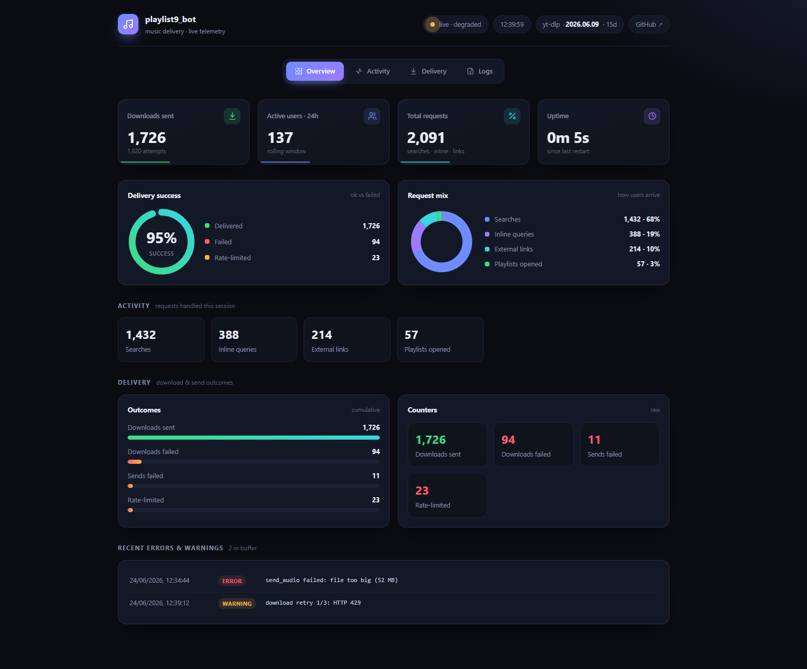

# 🎵 Music Downloader Bot

A Telegram bot **and web app** that searches and downloads music from multiple
sources and sends it as a tagged MP3 (up to 320 kbps, with cover art and
metadata) — the bot also grabs TikTok clips as video. Built with
[aiogram](https://github.com/aiogram/aiogram) 3, powered by `yt-dlp` + `ffmpeg`,
and shipped as a Docker image.

[](https://music.boredatom.dev/)
[](https://t.me/atomsdungeon_bot)
[](https://www.python.org/)
[](https://github.com/aiogram/aiogram)
[](LICENSE)

## ▶️ Try it

- **Web:** **[music.boredatom.dev](https://music.boredatom.dev/)** — search or
  paste a link, then click download. No account, no install.
- **Telegram:** **[@atomsdungeon_bot](https://t.me/atomsdungeon_bot)** — open the
  chat, send a track name, and pick a result.

## ✨ Features

- **Web download page** — a neon/cyberpunk site
  ([music.boredatom.dev](https://music.boredatom.dev/)) that mirrors the bot's
  *audio* features: search YouTube Music / SoundCloud or paste a Spotify, Apple
  Music, YouTube or SoundCloud link (tracks, playlists & albums), then download
  the tagged MP3 right in the browser. Powered by the same engine; no account, no
  install. Served on its own port (`WEB_PORT`, default `8080`), needs no Telegram
  token or database to run.
- **Single-source search with a toggle** — defaults to YouTube Music 🎵; the ⇄
  button switches the search to SoundCloud ☁️. Music only, no random videos.
- **Inline mode** — type `@atomsdungeon_bot query` in any chat to search and
  send the **track as a file**: cached tracks are sent instantly, new ones are
  downloaded on selection and the placeholder is replaced with the audio
  (requires `STORAGE_CHAT_ID`, see below). You can also **paste a link** there —
  a track, a playlist/album, or a TikTok clip — and it's handled just like in
  chat.
- **Download by link** — `youtube.com`, `youtu.be`, `music.youtube.com`,
  `soundcloud.com`. **Spotify** and **Apple Music** track links are also
  accepted: the bot reads the artist + title and finds a match on YouTube Music
  (those platforms are DRM-protected and can't be downloaded directly).
- **TikTok videos** — paste a TikTok link (`tiktok.com`, `vm.`/`vt.tiktok.com`)
  and the bot sends the clip back as a video (works in chat and inline).
- **Playlist & album links** — paste a YouTube/SoundCloud playlist, or a
  Spotify/Apple Music playlist *or album*, and the bot lists its tracks (up to
  100) as paginated buttons to download one by one. A link that is *both* a
  track and a playlist (e.g. a YouTube `watch?v=…&list=…`) asks which you meant.
- **Best available quality** — fetches the best source audio and sends MP3 at up
  to **320 kbps**.
- **Persistent cache** — delivered tracks are remembered in **PostgreSQL**
  (`file_id`), so re-requesting one (or sending it inline) is instant after a
  restart, with no re-download.
- **Paginated results** — clean "Artist — Title" buttons, 10 per page; the ◀/▶
  arrows appear only when there is somewhere to go.
- **Clean metadata** — MP3 files get tags (title, artist, album) and cover art
  embedded via `mutagen`, plus a dedicated 320×320 thumbnail for Telegram's
  preview. Missing album/cover are filled from **MusicBrainz + Cover Art
  Archive** (free, keyless; chosen after testing — it covers Russian music
  better than TheAudioDB/Discogs).
- **Concurrency & rate limits** — up to 3 simultaneous downloads per user and 8
  in total (extra requests are queued with a notice), plus a cap of 10 downloads
  per user per minute.
- **Cookies support** — point yt-dlp at a single `cookies.txt` for age-restricted
  or region-locked content on any supported site (YouTube, SoundCloud, TikTok);
  see below.
- **Resilient downloads** — transient network/extractor failures are retried
  with backoff before giving up.
- **Ephemeral chat** — your query message is deleted immediately and the
  search-results message auto-deletes after a few minutes; only the delivered
  tracks stay.
- **Healthcheck** (event-loop heartbeat) and **graceful shutdown** on SIGTERM.
- **Status dashboard** — a built-in web page at `http://localhost:8473` shows
  live metrics (uptime, unique users in the last 24 h, searches, downloads,
  success rate, …), recent error/warning logs, and `yt-dlp` build health. Served
  on port `8473` with no auth — keep it on a trusted network or behind a reverse
  proxy. [See it below](#-status-dashboard).

## 📊 Status dashboard

A self-contained dashboard (no build step, no external assets) served at
**`http://localhost:8473`** is your window into a running instance without
shelling into the container. It polls every few seconds and shows uptime, unique
users (24 h) and total requests with live sparklines, a delivery-success gauge,
a request-mix breakdown, per-source activity, download outcomes, and the most
recent error/warning logs — plus a banner that nudges you to bump `yt-dlp` once
the build is older than 30 days (stale builds are the usual cause of YouTube
breakage).



## 🚀 Quick start

### Run the published image (no clone needed)

The image is published to `ghcr.io/frostatom/playlist9_bot:latest`. The compose
file has no `${...}` interpolation and no build step — you just set your token in
the `environment:` block and start it. This works as-is on plain Docker and on
app platforms like **CasaOS / Portainer** (paste the compose, fill in the env
fields in the UI).

```sh
mkdir playlist9_bot && cd playlist9_bot
curl -O https://raw.githubusercontent.com/FrostAtom/playlist9_bot/main/docker-compose.yml

# edit docker-compose.yml → set TELEGRAM_BOT_TOKEN (get one from @BotFather)
#                            STORAGE_CHAT_ID only if you use inline mode

docker compose up -d
docker compose logs -f
```

Then open the web download page at **http://localhost:8080**, the status page at
**http://localhost:8473**, and/or message your bot on Telegram. To update later:
`docker compose pull && docker compose up -d`. To stop: `docker compose down`. CI
rebuilds and pushes the image (multi-arch: `linux/amd64,linux/arm64`) on every
push to `main`.

### Build from source (for development)

The compose file pulls the published image, so build and tag it locally first,
then bring the stack up:

```sh
git clone https://github.com/FrostAtom/playlist9_bot.git
cd playlist9_bot
docker build -t ghcr.io/frostatom/playlist9_bot:latest .
# set TELEGRAM_BOT_TOKEN in docker-compose.yml, then:
docker compose up -d
```

## ⚙️ Configuration

Configuration lives directly in the `environment:` blocks of
**`docker-compose.yml`** (no `.env`, no interpolation — so it can't break on
CasaOS and friends). Only `TELEGRAM_BOT_TOKEN` is required (get one from
[@BotFather](https://t.me/BotFather)); the bundled `db` credentials default to
`playlist9`/`playlist9`. Everything else is optional and has a default baked into
`app/config.py` — to override one, add it to the bot's `environment:`.

| Variable | Default | Description |
| --- | --- | --- |
| `TELEGRAM_BOT_TOKEN` | — | **Required.** Bot token from @BotFather. |
| `STORAGE_CHAT_ID` | — | Channel id (`-100…`) where the bot is admin; enables inline file delivery. |
| `DATABASE_HOST` | `db` | PostgreSQL host for the persistent `file_id` cache (the bundled `db` service). |
| `DATABASE_PORT` | `5432` | PostgreSQL port. |
| `DATABASE_USER` | `playlist9` | PostgreSQL user — keep it equal to the `db` service's `POSTGRES_USER`. |
| `DATABASE_PASSWORD` | `playlist9` | PostgreSQL password — keep it equal to the `db` service's `POSTGRES_PASSWORD`. |
| `DATABASE_NAME` | `playlist9` | PostgreSQL database name — keep it equal to the `db` service's `POSTGRES_DB`. |
| `MAX_FILE_SIZE_MB` | `50` | Max size of a sent file (Telegram caps bots at 50 MB). |
| `MAX_RESULTS` | `30` | Results fetched per search. |
| `PLAYLIST_LIMIT` | `100` | Max tracks listed for a pasted playlist link. |
| `RESULTS_PER_PAGE` | `10` | Results shown per page. |
| `AUDIO_QUALITY` | `320` | MP3 quality in kbps (best source, up to 320). |
| `INLINE_RESULTS` | `20` | Results fetched for an inline query. |
| `RATE_PER_MINUTE` | `10` | Max downloads a single user may trigger per minute. |
| `COOKIES_FILE` | — | Path to a single `cookies.txt` inside the container, used for every yt-dlp site (YouTube, SoundCloud, TikTok); see [Cookies](#-cookies-age-restricted--region-locked-content). |
| `WEB_PORT` | `8080` | Port for the public web download page; `0` disables it. |
| `WEB_HOST` | `0.0.0.0` | Bind address for the web download page inside the container. |
| `METRICS_PORT` | `8473` | Port for the built-in status page; `0` disables the HTTP server. |
| `METRICS_HOST` | `0.0.0.0` | Bind address for the status page inside the container. |

## 💬 Usage

1. Open the bot, send `/start`.
2. Send a track name, or paste a link (YouTube, SoundCloud, Spotify, Apple Music,
   or TikTok).
3. Get an MP3 back (or the video, for TikTok). Your query and the search results
   clean themselves up; only the delivered files stay.

### Inline mode setup

To send actual files inline, do the one-time setup:

1. In [@BotFather](https://t.me/BotFather): `/setinline` → pick the bot → set a
   placeholder, and `/setinlinefeedback` → enable (so the bot is told which
   result was chosen and can deliver the file).
2. Create a private channel, add the bot as an admin, and set `STORAGE_CHAT_ID`
   to its id (`-100…`). The bot uploads downloads there to obtain a `file_id`.

Without `STORAGE_CHAT_ID`, inline mode still re-sends already-cached tracks as
files and falls back to a link for new ones.

## 🍪 Cookies (age-restricted / region-locked content)

Some content won't download without a logged-in session (age-gated videos,
region-locked or "sign in to confirm" content, some TikToks). You can hand yt-dlp
your browser cookies to get past that. **One `cookies.txt` covers every site** —
yt-dlp automatically uses the cookies matching each request's domain (YouTube,
SoundCloud, TikTok, …), so you can export from several sites into the same file.

1. Install a cookies exporter extension — e.g. **"Get cookies.txt LOCALLY"**
   ([Chrome](https://chromewebstore.google.com/detail/get-cookiestxt-locally/cclelndahbckbenkjhflpdbgdldlbecc))
   — it exports in the Netscape `cookies.txt` format yt-dlp expects.
2. Log in to the site in your browser (e.g. YouTube and/or TikTok), open the
   exporter **on that site's tab**, and export. Save (or concatenate) the
   entries into a single `cookies.txt`.
3. Drop it into the `cookies/` folder next to `docker-compose.yml` (it's mounted
   into the container at `/cookies`), and set in the bot's `environment:`:

   ```yaml
   COOKIES_FILE: /cookies/cookies.txt
   ```

4. `docker compose up -d`. If the path is empty or the file is missing, the bot
   simply runs without cookies.

> Treat `cookies.txt` like a password — it grants access to your account. Keep
> it private; it's already covered by `.gitignore`.

## 🧠 How it works

- **Search** goes through YouTube Music (`ytmusicapi`, `songs` filter) or
  SoundCloud (`yt-dlp` `scsearch`), one source at a time, switchable via the ⇄
  button.
- **Download** always pulls the audio with `yt-dlp` + `ffmpeg` and converts to
  MP3 (up to 320 kbps). YouTube Music supplies authoritative metadata; gaps are
  enriched from MusicBrainz.
- **Spotify / Apple Music** links can't be downloaded directly (DRM), so the bot
  reads the track's artist + title from the page's Open Graph tags and searches
  YouTube Music for a match — no API keys required.
- **TikTok** links are downloaded as the original MP4 (no audio extraction) via
  the same shared `yt-dlp` primitive (`download_media`) the audio sources use, so
  cookies, retries and thumbnail handling are identical — and sent as a video.
- **Delivered `file_id`s** are stored in PostgreSQL, so the same track re-sends
  instantly later (and inline mode serves it as playable audio) without a
  re-download.
- **One classifier, three front-ends.** Deciding *what* a pasted/typed input is
  (TikTok, YouTube/SoundCloud track or playlist, Spotify/Apple track or
  playlist/album, or a plain search) lives in a single pure function
  (`music/resolver.py`) shared by the chat handler, inline mode, and the web app
  — so all three behave identically.
- **The web app** reuses the same `MusicService` and limiters: `/api/search`
  classifies and returns tracks, `/api/download` downloads the tagged MP3 and
  streams it straight to the browser (no Telegram `file_id` round-trip).

## 🏗️ Architecture

The package is grouped by concern: `music/` (engine), `bot/` (Telegram
presentation), `infra/` (cross-cutting plumbing), `web/` (web download page +
status dashboard).

```
bot.py                          — thin entry point
healthcheck.py                  — Docker HEALTHCHECK script (checks the heartbeat)
app/
  config.py                     — settings from environment (Settings)
  application.py                — Dispatcher/Bot wiring, polling, graceful shutdown
  models.py                     — shared domain models (Track, Meta, AudioFile, VideoFile)
  music/
    service.py                  — MusicService: search + download routing
    resolver.py                 — shared input classifier (bot + inline + web)
    links.py                    — Spotify / Apple Music link, playlist & album scraping
    video.py                    — TikTok link detect + video (MP4) download
    metadata.py                 — filename cleanup, ID3 tags, cover + thumbnail
    metadata_provider.py        — album/cover enrichment (MusicBrainz / Cover Art Archive)
    sources/base.py             — AudioSource abstraction (extension seam)
    sources/ytdlp.py            — shared yt-dlp primitive (download_media: cookies, retries, thumbnail) + audio base
    sources/youtube.py          — YouTube Music (search via ytmusicapi)
    sources/soundcloud.py       — SoundCloud (scsearch)
  bot/
    router.py                   — aiogram router (thin: parse updates, dispatch)
    delivery.py                 — download → validate → send pipeline (audio + video)
    inline.py                   — inline-mode: classify query/link → results → file_id
    formatting.py               — result/playlist messages + inline keyboards
    messages.py                 — all user-facing text in one place
    caches.py                   — in-memory state (searches, inline payloads, links)
    deps.py                     — Deps: the dependency bundle handlers close over
    telegram.py                 — error-tolerant aiogram call wrappers
  infra/
    store.py                    — PostgreSQL-backed file_id cache (asyncpg)
    limiter.py                  — concurrent download limits + per-user rate limit
    health.py                   — heartbeat for the healthcheck
    metrics.py                  — in-memory counters, unique users, recent-log buffer
  web/
    server.py                   — two aiohttp servers: download page + status dashboard
    api.py                      — web download page API: /api/search + /api/download
    templates/landing.html      — web download page markup (neon/cyberpunk)
    templates/status.html       — status page markup
tests/                          — pytest suite (resolver, web helpers, /api/search)
```

**Adding a source:** implement `AudioSource` (or subclass `YtDlpSource`) in
`app/music/sources/` and register it in `build_service()` (`app/application.py`).

### Tests

A small, offline pytest suite lives in `tests/` (no network, no downloads). It
runs in Docker; dev-only deps are in `requirements-dev.txt` (not baked into the
image):

```sh
docker run --rm -v "$PWD:/app" ghcr.io/frostatom/playlist9_bot:latest \
  sh -c "pip install --user -q -r requirements-dev.txt && python -m pytest"
```

## 🛠️ Tech stack & dependencies

- [**aiogram**](https://github.com/aiogram/aiogram) `3.15.0` — async Telegram Bot framework
- [**yt-dlp**](https://github.com/yt-dlp/yt-dlp) `2026.6.9` — audio + video downloading
- [**ytmusicapi**](https://github.com/sigma67/ytmusicapi) `1.12.1` — YouTube Music search (keyless)
- [**mutagen**](https://github.com/quodlibet/mutagen) `1.47.0` — ID3 tagging
- [**Pillow**](https://github.com/python-pillow/Pillow) `11.0.0` — thumbnail generation
- [**asyncpg**](https://github.com/MagicStack/asyncpg) `0.30.0` — PostgreSQL driver (persistent `file_id` cache)
- [**ffmpeg**](https://ffmpeg.org/) — audio extraction/conversion (system package)
- [**PostgreSQL**](https://www.postgresql.org/) `16` — persistent cache store (Docker service)
- Metadata: [MusicBrainz](https://musicbrainz.org/) + [Cover Art Archive](https://coverartarchive.org/)

## 👤 Author

Created by **Claude** (Anthropic's Claude Code).

## 📄 License

Released under the [MIT License](LICENSE).
